# Student Portal - Functional Requirements

## Overview

This document outlines the functional requirements for the **Student Portal** signup system, including reminder automation, admin dashboard, and compliance features.

---

## Core Features: Student Portal

### QR Code Landing Page

- Responsive design for mobile-first experience
- Seamless entry point for student registration

### Training Class Selection

- Single class selection from **6 training types**
- User can only enroll in one class at a time

### Input Validation

- Email **or** phone number required (choose one approach for implementation)
- Form validation on submission

### Confirmation Flow

- Confirmation screen displaying signup details
- Allow users to review before final submission

### Responsive Design

- **Top priority**: Mobile responsiveness
- Open question: Mobile only, or tablets too?
- *Note: Desktop and laptop screens are already handled*

---

## Reminder System

### Automated Scheduling

- Scheduling based on class-specific intervals
- Triggered by enrollment completion

### Multi-Channel Delivery

- Email and SMS support
- Integration options: Twilio (Email), Amazon SES, SendGrid (SMS), Nodemailer
- *Start with Nodemailer for initial testing*

### Message Templates

- Custom templates for each communication type
- Different templates for email vs. SMS
- Dynamic link injection (security considerations: per-student links, batch links, or universal links?)

### Reliability

- Retry mechanisms for failed deliveries
- Fallback routing for critical messages

---

## Admin Dashboard

### Signup Management

- View all registered students in a paginated list
- Search functionality across student records
- *Note: Start with frontend pagination, migrate to backend as needed*

### Filtering & Export

- Multi-criteria filtering for better UX
- CSV export functionality for student lists

### Reminder Management (CRUD)

- Create, Read, Update, Delete operations for reminders
- *Remember: Use PATCH instead of PUT wherever possible*
- Template editor with live preview
- Opt-out management interface

---

## Compliance & Privacy

### Customer Controls

- One-click email unsubscribe links
- Opt-out database with enforcement

### Regulatory Compliance

- GDPR compliance logging
- CAN-SPAM compliance logging
- Audit trails for all compliance-related actions

---

## System Requirements

### Delivery & Monitoring

- Delivery status tracking across all channels
- Error logging and monitoring
- Morgan/Winston logging in Dockerized setup

### Audit & Security

- Audit trails for admin actions (CRUD and PATCH operations)
- Compliance and security support
- Tamper-proof logs for regulatory requirements

### Health Checks

- Scheduled job health checks
- Automated alerts for job failures
- System uptime monitoring

---

## Technical Architecture

### Backend

#### Technology Stack

- **Runtime**: Node.js 18+
- **Framework**: Express.js
- **Database**: PostgreSQL
- **ORM**: Prisma
- **Job Queue**: Bull + Redis
- **Validation**: Zod
- **Authentication**: JWT + bcrypt
- **Email**: SendGrid
- **SMS**: Twilio
- **Logging**: Winston + Morgan

#### Architecture Pattern

**Microservices with Three-Tier Architecture**

Microservices architecture chosen for better fault tolerance over monolith.

**Controller → Services → Repository Pattern**

- **Repository Layer**: Handles all database operations
- **Services Layer**: Handles business logic (data modification, deletion, updating/patching)
- **Controllers Layer**: Handles client requests and forwards to services layer

This pattern ensures minimal LOC changes when modifications are needed.

#### Language Choice

JavaScript (not TypeScript) for initial implementation:

- Avoids unnecessary complexity
- Carefully typed JS > TS for this use case
- Faster compilation time
- TypeScript migration feasible at later stage

#### Database Design

```sql
-- students table
id (UUID, PK)
email (VARCHAR, indexed, nullable)
phone (VARCHAR, indexed, nullable)
opted_out_email (BOOLEAN, default: false)
opted_out_sms (BOOLEAN, default: false)
created_at (TIMESTAMP)
updated_at (TIMESTAMP)

-- signups table
id (UUID, PK)
student_id (UUID, FK -> students)
class_type (ENUM)
reminder_scheduled_date (TIMESTAMP)
reminder_sent_at (TIMESTAMP, nullable)
status (ENUM: pending, sent, failed)
created_at (TIMESTAMP)

-- message_templates table
id (UUID, PK)
class_type (ENUM)
channel (ENUM: email, sms)
subject (VARCHAR, nullable)
body (TEXT)
schedule_link (VARCHAR)
updated_at (TIMESTAMP)

-- delivery_logs table
id (UUID, PK)
signup_id (UUID, FK)
channel (ENUM)
status (ENUM: sent, failed, delivered, bounced)
provider_message_id (VARCHAR)
error_message (TEXT, nullable)
created_at (TIMESTAMP)

-- audit_logs table
id (UUID, PK)
admin_id (UUID)
action (VARCHAR)
resource_type (VARCHAR)
resource_id (UUID)
metadata (JSONB)
created_at (TIMESTAMP)
```

*Note: Corrections and additions to be made on the fly*

#### Background Job Architecture

- Queueing service + caching service for email and SMS reminders
- Options: Bull Queue, RabbitMQ, Redis PUB/SUB pattern
- Dead Letter Queue for failed jobs
- Rate limiting (custom logic or libraries like express-rate-limit)
- Separate queues for Emails/SMS/Failed Reminders to avoid conflicts

#### Security Considerations

- JWT authentication (custom implementation, not BetterAuth or Clerk)
    - Rationale: Economic and scalability reasons
- Custom error classes for consistent HTTP status codes
- Global error middleware (centralized)

#### Monitoring

- Prometheus for monitoring (post-MVP, finetuning stage)

---

### Frontend

#### Technology Stack

- **Framework**: React 18+ (Vite for build)
- **Language**: JavaScript (TypeScript in the future)
- **Styling**: Chakra UI / Shadcn UI
- **Routing**: React Router
- **State Management**: Zustand
- **QR Code**: qrcode.react
- **Icons**: Lucide React

#### Project Structure

```
src/
  components/
    shared/
    student/
    admin/
  pages/
    StudentSignup.jsx
    AdminDashboard.jsx
    TemplateManager.jsx
    OptOutConfirmation.jsx
  store/ (global state manager)
    StudentStore.jsx
    AdminStore.jsx
    ReminderStore.jsx
  utils/
    formatters.jsx
    constants.jsx
```

#### Form Handling & Validation

- **React Hook Form**: Performance + validation
- **Zod Schema Validation**: Error-free database operations
- **Debounced Input Validation**: Real-time UX
- **Real-time Error Feedback**: Immediate user guidance

#### Mobile Optimizations

- Touch-friendly inputs
- Navbar shrinking into sidebar (hamburger menu) for better UX
- Progressive Web App (PWA) capabilities
- Viewport meta tag configuration

---

### DevOps

#### Hosting & Containerization

- **Platform**: Amazon AWS
- **Containerization**: Docker
- **CI/CD**: GitHub Actions (for easier staging automation)

---

## Open Questions

1. **Responsive Design**: Mobile-only or include tablet support?
2. **Contact Method**: Email or phone number implementation approach?
3. **Dynamic Links**: Per-student links, batch links, or universal links for scheduling?

---

## Phase-Wise Development Plan

### Phase 1: Project Setup

**Backend Setup**

1. Setup the Express Server with JavaScript
2. Configure the Prisma setup with PostgreSQL
3. Set up environment variables and dotenv configurations
4. Create the devised folder structure
5. Configure ESLint + Prettier setup
6. Configure Husky setup to ensure consistent coding style
7. Setup Dockerfiles for each microservice to ensure multi-stage builds

**Frontend Setup**

1. Vite + React project in JavaScript setup
2. Styling: TailwindCSS, Chakra/Shadcn setup
3. React Router setup
4. Axios setup with interceptors according to the modern setup

**DevOps Setup**

1. GitHub repo initialization
2. CI/CD pipeline skeleton
3. Environment variable management
4. Deploy staging environments

---

### Phase 2: Database & Core Backend Setup

**Database Schema**

1. Prisma schema setup
2. Migration scripts
3. Seed data for development (mock data - please provide if available)
4. Database indexes optimization (as decided in the database tentative schema)

**Authentication System**

1. JWT authentication using tokens in cookies setup to mitigate security vulnerabilities
2. Admin login/register/refreshToken endpoints
3. Password hashing logic (likely bcryptJS)
4. Token refresh mechanism: Short-lived AccessToken, long-lived RefreshToken

**Core API Development**

1. API documentation (will attach soon once dev process starts, or might use SwaggerUI Docs)
2. Student validation logic + Zod schema validation + React Hook Forms
3. Error handling middleware
4. Request logging setup in the Controllers file for better tracking & observability

---

### Phase 3: Student Portal Frontend

**Landing Page**

1. QR code generation/display
2. Mobile responsive hero section
3. Class selection UI component
4. Accessibility implementation

**Registration Form**

1. React Hook Form setup
2. Email/Phone validation
3. Progressive disclosure pattern
4. Real-time validation feedback
5. Error handling UI

**Confirmation Screen**

1. Success message component (through toast notifications)
2. Signup summary display (through modals)
3. Social share functionality (optional)

**Integration Testing**

1. Form submission flow
2. Error scenarios
3. Mobile responsiveness testing

---

### Phase 4: Reminder Scheduling System

**Job Queue Implementation**

1. Bull Queue configuration
2. Redis connection setup
3. Job processor for reminders (Node-cron)
4. Retry logic implementation

**Email Service**

1. SendGrid integration (we already have the paid plan)
2. Template rendering engine
3. Unsubscribe link generation
4. Delivery tracking

**SMS Service**

1. Twilio API integration
2. Character limit handling
3. STOP command processing
4. Delivery status webhooks

**Scheduler Logic**

1. Cron job for checking due reminders
2. Batch processing optimizations
3. Rate limiting compliance

---

### Phase 5: Admin Dashboard

**Authentication & Layout**

1. Protected route setup
2. Admin layout component
3. Navigation sidebar
4. Logout functionality

**Signup Management**

1. Data table with pagination
2. Search & filter implementation
3. Sorting functionality
4. Real-time status updates

**Template Editor**

1. Live preview functionality
2. Variable interpolation (dynamic value insertion)
3. Save/revert changes

**CSV Export**

1. Export service implementation
2. Column customization
3. Date range filtering
4. Download handler

**Opt-Out Management**

1. Opt-out and opt-in features
2. Preference management interface

---

### Phase 6: Testing

1. Unit tests for core services
2. Integration tests for API endpoints
3. End-to-end testing for user flows
4. Performance testing
5. Security testing

---

### Phase 7: Deployment

**Infrastructure Setup**

1. Caddy/Nginx for hosting
2. SSL certificate setup
3. Environment variable configuration
4. Database migration
5. Production environment setup

**Optimization**

1. Query optimization
2. Frontend bundle size reduction
3. CDN configuration (since our requirement is content heavy)

**Monitoring & Maintenance**

1. Health check endpoints
2. Error tracking setup
3. Performance monitoring
4. Backup and recovery procedures

SYSTEM DESIGN & WORKFLOW DIAGRAMS:

HIGH LEVEL SYSTEM ARCHITECTURE:

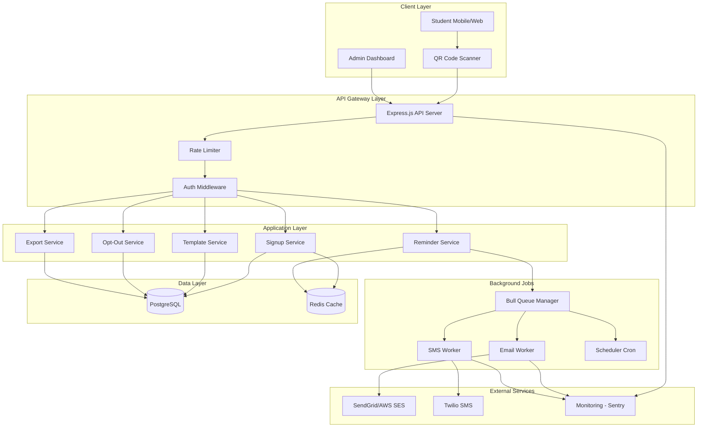

STUDENT SIGNUP WORKFLOW:

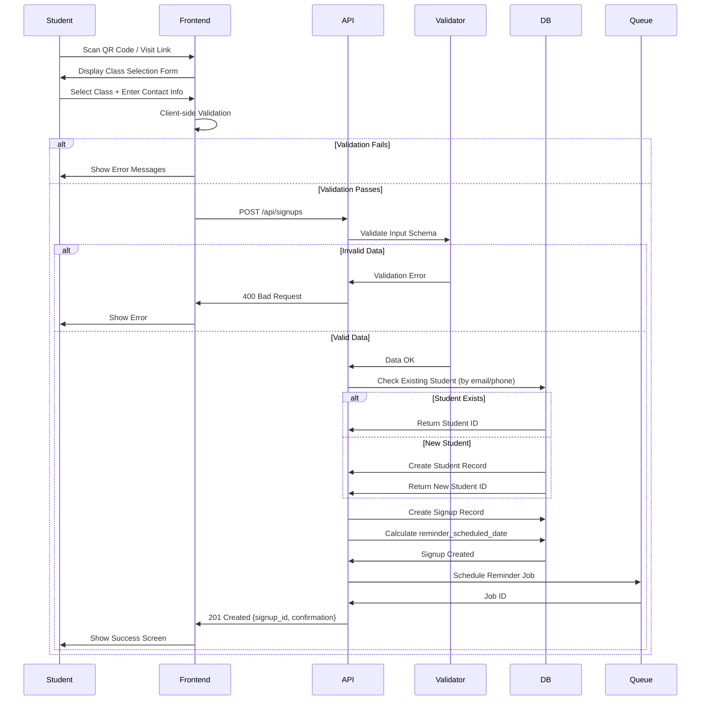

Reminder Scheduling & Delivery Workflow:

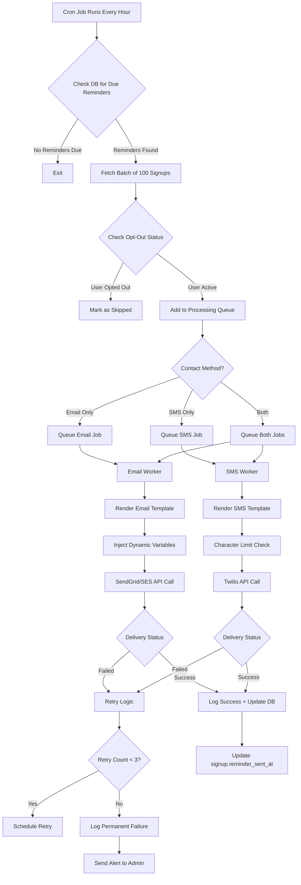

ADMIN DASHBOARD FLOW:

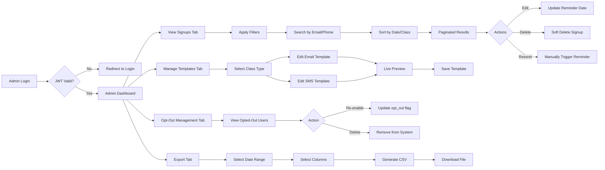

OPT OUT HANDLING FLOW(UNSUBSRIBING):

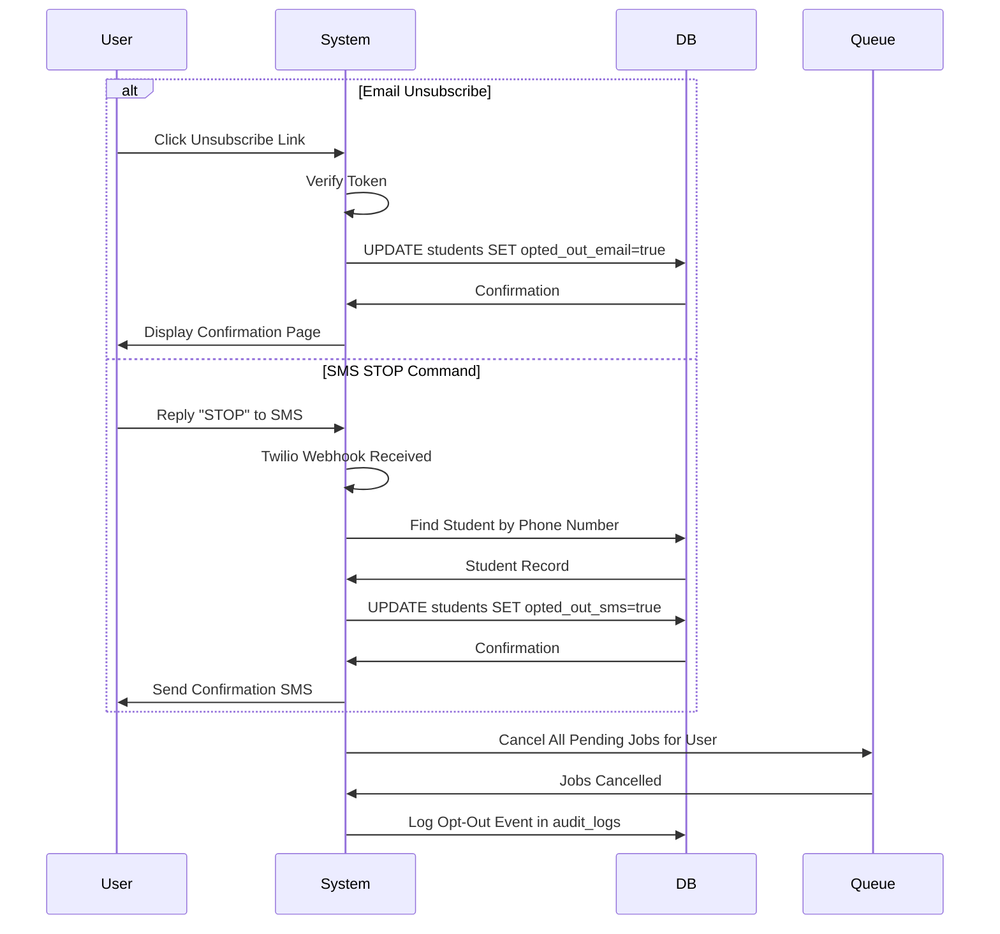

DB SCHEMA DIAGRAM:

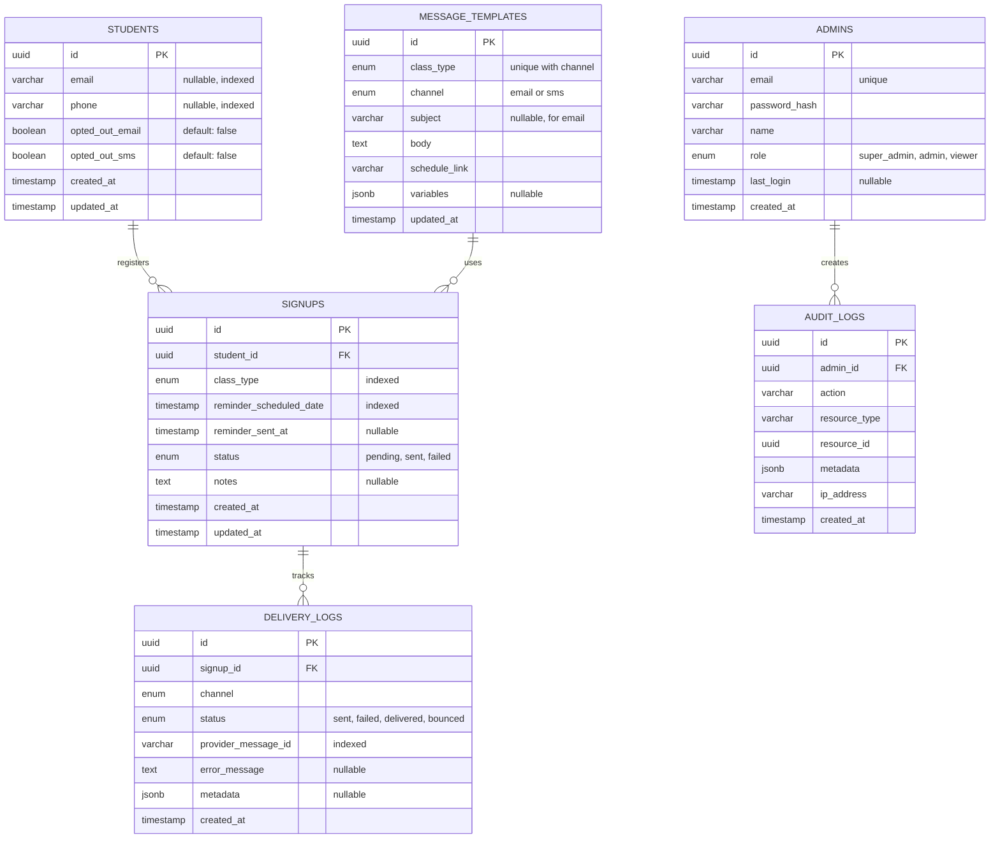

BACKGROUND JOB PROCESSING ARCHITECTURE:

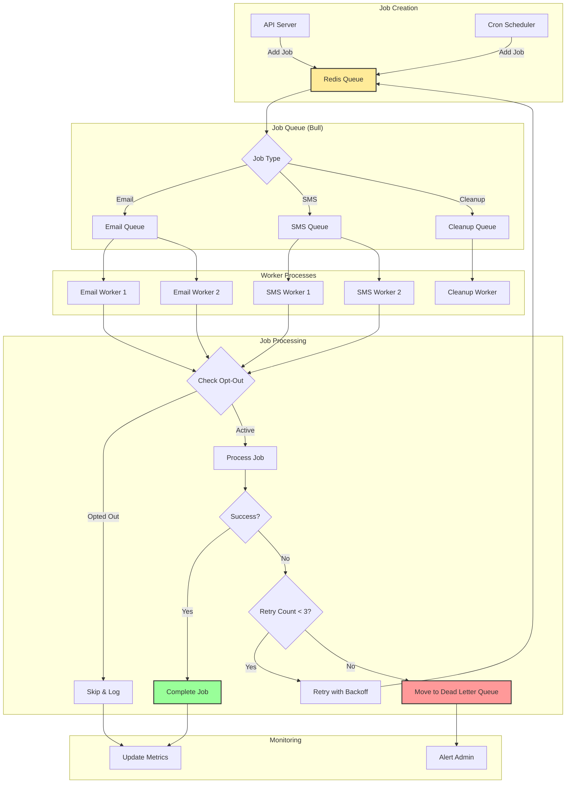

API REQUEST FLOW(WITH CACHING):

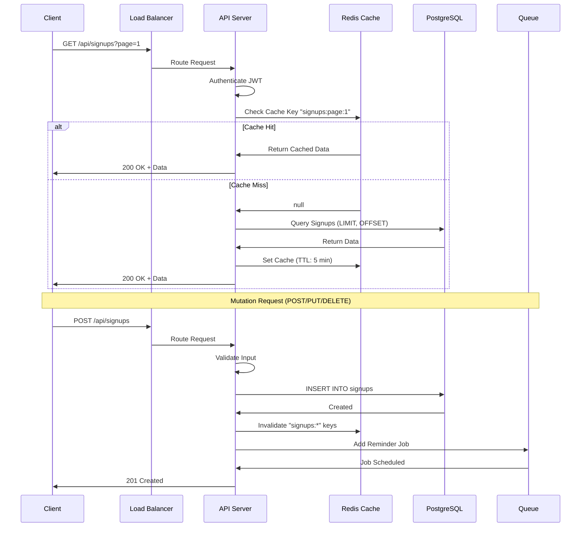

SCALABILITY CONSIDERATIONS:

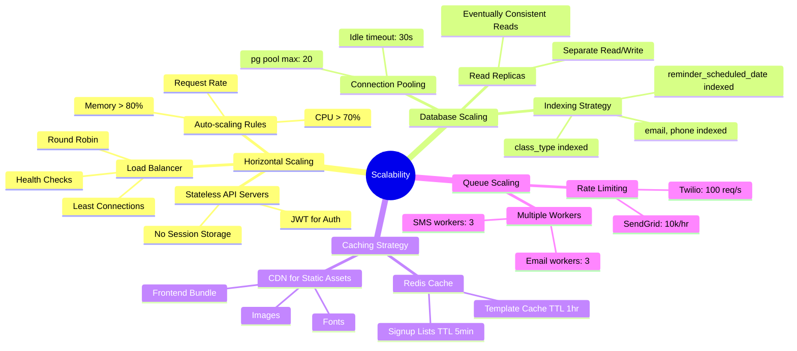

RELIABILITY & FAULT TOLERANCE:

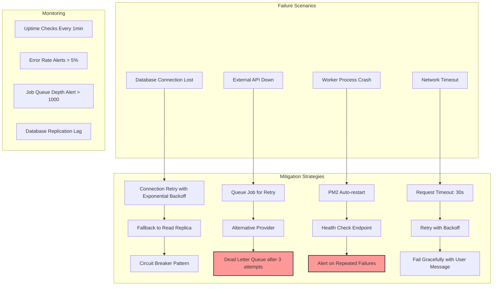

SECURITY ARCHITECTURE:

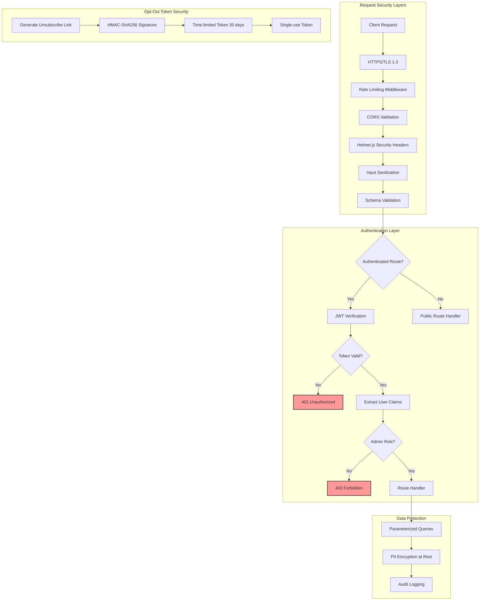